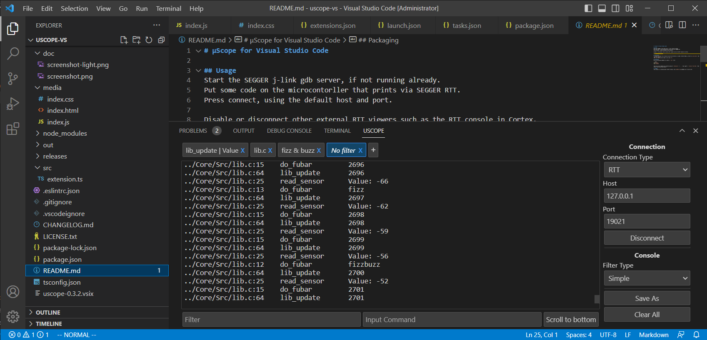

# μScope for Visual Studio Code

## Usage
Start the SEGGER J-Link gdb server, if not running already.
Put some code on the microcontorller that prints via SEGGER RTT.
Press connect, using the default host and port.

Disable or disconnect other external RTT viewers such as the RTT console in Cortex.



## Developing
To compile and test this extension open this directory in vscode. Install Node.js, then run `npm install` and `npm run compile`.
Then you should just be able to run with `F5`.

## Packaging
Run the following commands to create a `.vsix` file:

```bash
npm install
vsce package
```

The file can be loaded into vscode by going to `extensions` -> `...` (top right) -> `Install from VSIX`. Then select the file you just built.

# LICENSE
This project is licensed under the MIT license, see [LICENSE.txt](LICENSE.txt) for more info.